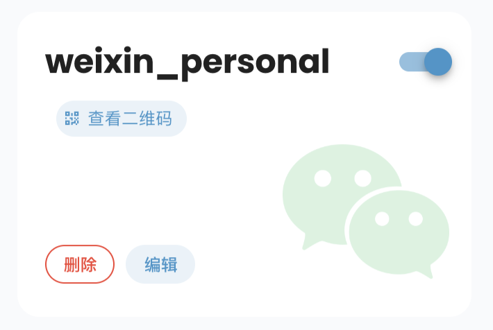

# 接入个人微信

> v4.22.0 引入。

AstrBot 支持通过 `个人微信` 适配器接入微信个人号。该适配器基于**腾讯微信官方** `openclaw-weixin` 接口实现，使用扫码登录和长轮询收发消息，不需要配置 Webhook 回调地址。

> [!NOTE]
> 需要升级到最新的手机微信版本：>= 8.0.70

## 支持的消息类型

| 消息类型 | 是否支持接收 | 是否支持发送 | 备注 |
| --- | --- | --- | --- |
| 文本 | 是 | 是 | |
| 图片 | 是 | 是 | 接收时会下载并解密到本地临时目录 |
| 语音 | 是 | 是* | *微信云端会自动转录成文本，无需本地转录 |
| 视频 | 是 | 是 | 接收时会下载并解密到本地临时目录 |
| 文件 | 是 | 是 | 接收时会下载并解密到本地临时目录 |

## 创建机器人

1. 进入 AstrBot WebUI。
2. 点击左侧栏 `机器人`。
3. 点击右上角 `+ 创建机器人`。
4. 选择 `个人微信`。

## 配置项说明

通常只需要关注以下几个配置：

- `ID(id)`：随意填写，用于区分不同的机器人实例。
- `启用(enable)`：勾选。

其余配置**保持默认即可**，一般无需修改，除非您明确知道用途：

- `二维码轮询间隔(weixin_oc_qr_poll_interval)`
- `长轮询超时(weixin_oc_long_poll_timeout_ms)`
- `API 超时(weixin_oc_api_timeout_ms)`

> [!TIP]
> `token` 和 `account_id` 会在扫码登录成功后由 AstrBot 自动保存，通常不需要手动填写。

## 扫码登录

1. 填好配置后点击 `保存`。
2. 返回机器人列表，AstrBot 会自动向微信接口申请登录二维码。
3. 在**机器人卡片**中点击 “查看二维码” 按钮，会弹出二维码对话框。（点击保存之后可能需要等 5 到 10 秒左右才会出现这个按钮）
4. 使用手机微信扫码，并在微信内确认登录。

登录成功后，AstrBot 会自动保存登录态。后续重启时，如果登录态仍有效，通常不需要再次扫码。

> [!NOTE]
> 1. 如果二维码过期，AstrBot 会自动重新申请新的二维码。刷新后请使用新的二维码重新扫码。
> 2. 如果 WebUI 没看到 “查看二维码” 按钮，可以前往终端或者 WebUI 控制台，找到 `请使用手机微信扫码登录，二维码有效期 5 分钟，过期后会自动刷新。` 对应的日志，附近会显示二维码扫码链接和终端直接输出的二维码，直选择一种方式扫码即可。

## 验证

登录成功后，用微信发送一条消息。如果 AstrBot 能正常回复，说明接入成功。

也可以在 WebUI `控制台` 中观察日志，确认适配器已经完成登录并开始轮询消息。

## 修改头像和备注名

进入微信聊天会话，点击右上角的齿轮图标，再点击右上角的「...」图标，即可修改头像和备注名。

## 多媒体文件保存位置

接收到的图片、视频、文件、语音会被 AstrBot 下载并解密后保存到本地临时目录：

`data/temp`

这些文件属于 AstrBot 的临时缓存文件，后续插件、Agent 或文件服务可以继续读取和处理。

## 已知说明

- 该适配器通过扫码登录个人微信，接入方式与微信公众号、企业微信不同。
- 不需要配置公网回调地址，也不需要开启统一 Webhook 模式。

